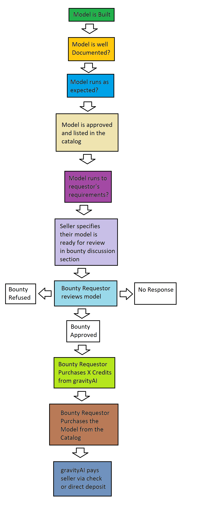

# Bounty Fulfillment  Process

As an independent seller, you may always submit models in an attempt to fulfill a Bounty Request.  If your model is accepted, you might stand to make some money off of it.  That being said, the approval process for said models is very much dependent on the approval of the individual creating the Bounty Request.  If they deem your model sufficient, they will purchase a certain number of credits from gravityAI (relevant to their budget) and purchase your model.  

They are under no obligation to accept any particular model, for a variety of reasons and they may or may not inform you of said reasons.  

As such, it may be necessary that the models you submit are qualified and competitive.  They must be well documented, performant, accurate, and fulfill whatever needs the Bounty Requestor might have specified. Even in this case, their requirements may change, so it may be worth keeping up-to-date with the bounty request.  

Currently, the bounty fulfillment process may flow as follows…

