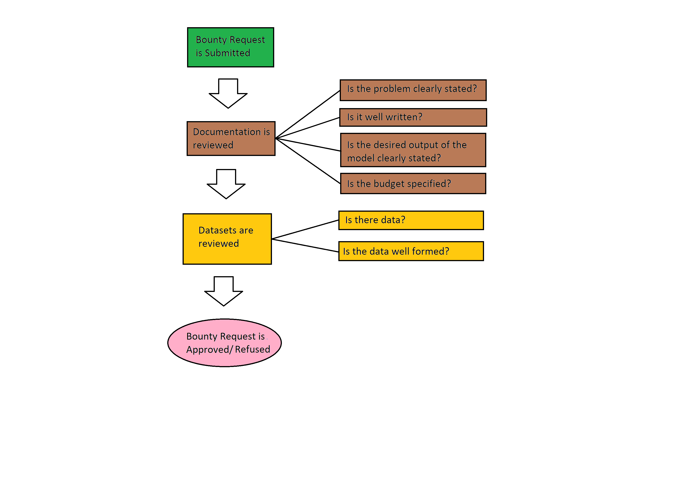

# Bounty Request Approval Process

gravityAI offers a powerful means for companies and individuals to request AI Solutions to particular problems.  By leveraging our platform's [bounty feature](./glossary.md#Bounty Feature), sellers will compete to fulfill your AI solution request.  Given the nature of reaching out to potentially hundreds of sellers, it is advisable to ensure that your request is well documented.  For sellers to understand your AI needs, it is imperative that you clearly define the problem you wish to solve, know your budget to solve this problem, and provide as many details as necessary to solve your particular needs.

If your request is not well documented, not only will people not submit models to your request, but those few models that make it might be far off from your desired goal.  Providing test data, or at least the schema of data, will help sellers tremendously as they work to fulfill your needs.

In general, the bounty request approval flow might proceed as follows:

