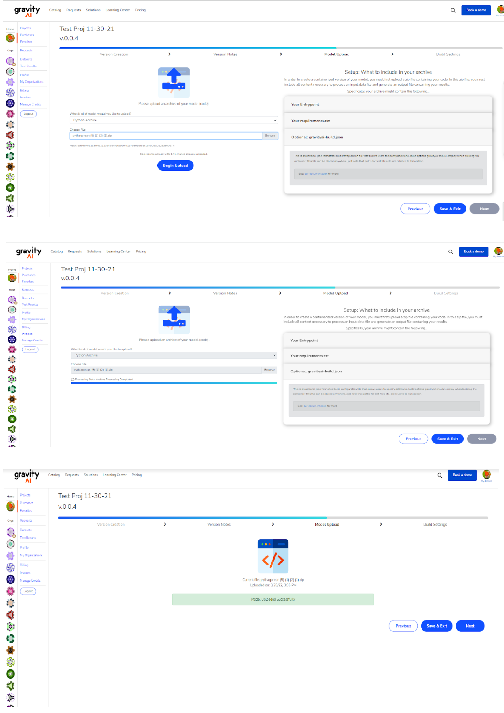

# Build Configuration

## Prior to the Build

### What to you know prior to creating your project

-  What to know prior to creating your project:

    * If your code works locally, it doesn’t necessarily  mean that it will work when it gets put into a docker container.  You must create your project in such a way that it must be able to run on a linux-based container. This is currently a container derived from debian buster-slim, but we might migrate to an ubuntu based container eventually.
        * When in doubt, feel free to download one of the many free models and use that docker container as your dev environment.  E.g. copy your model code over to the container, install your dependencies, and attempt to run it at the CLI.  Does it work as expected?
    * gravityAI does not (currently) support the M1 chipset that can be found in many MACs nowadays.  If you attempt to run a gravityAI container on such platforms, they will not work.
    * gravityAI prides itself on being a marketplace that consists of high-quality, well documented models. 
        * Coding a working model is, very much, the first step of getting the model approved and listed on the marketplace.  Clearly listing use cases for your model, how/when to use it, what the performance expectations are, how much memory the buyer should allocate to docker memory, etc. can go a long way in helping your model getting approved (also in selling it as well).
    * Please don’t use libraries that have copy-left licenses.  Use of these licenses might lead to your model not being approved. 
    * Handling multi-file input/output is a bit tricky at this time.  While possible, have single file input/output is preferred.
    * Currently, our supported languages are Python 3.5 - 3.10, Python 2.7 (recommend not using), and R 3.6  

-  Coding your Hello Universe Project

    * We recommend following the tutorial created by Youtuber Code With Ania, you can view [here](https://youtu.be/i6qL3NqFjs4)
    * Regardless of how you create your model...
        * you must take care to carefully list your dependencies in a **requirements.txt** file or using **renv**
        * you must have a single entry script that takes into account, at minimum, a path to an input file and a path to an output file. (see Input/Output Handling)
    * You may or may not decide to include a gravityai-build.json to allow for prefilled build settings or tests that can occur during build processing.


## Build Configuration File

You can control additional build options for your project by including a "gravityai-build.json" file in your uploaded archive. This file should be in standard json format. Be sure it's located at the root level of the project:<br/>
```
Project_to_Upload/
   |--> src/
   |--> gravityai-build.json
```

### Example Build Configuration: gravityai-build.json

The following example installs tesseract and support libraries as "SystemPackages". This file may contain one to many tests, each of which containing an input file along with expected output to use as a test at build time.

```
{
  "SystemPackages": [
    "g++",
    "libleptonica-dev",
    "autoconf",
    "automake",
    "libtool",
    "pkg-config",
    "libpng-dev",
    "libjpeg62-turbo-dev",
    "libtiff5-dev",
    "zlib1g-dev",
    "tesseract-ocr"
  ],
  "Tests": [
    {
      "RelativeInputPath": "./OCR-Passage-Test-1.jpg",
      "RelativeReferencePath": "./OCR-Passage-Test-1.result.txt"
    },
    {
      "RelativeInputPath": "./OCR-Check-Test-1.jpg",
      "RelativeReferencePath": null
    }
  ]
}
```

### SystemPackages Field

This is an array of string values, each the name of a linux system package. At the moment, these packages should be available on the debian linux distribution. The base container image is debian {{supported.debian.version_name}}, so you may need to include additional packages not normally available on {{supported.debian.version_name}}. Below is an example of how to specify SystemPackages:

```
"SystemPackages": [
    "g++",
    "automake"
]
```

### Tests Field

<b>Tests</b> is an array of Test Objects:

```
"Tests": [
    {
      "RelativeInputPath": "./OCR-Passage-Test-1.jpg",
      "RelativeReferencePath": "./OCR-Passage-Test-1.result.txt"
    },
    {
      "RelativeInputPath": "./OCR-Check-Test-1.jpg",
      "RelativeReferencePath": null
    }
]
```

Each Test object has the following fields:

- `RelativeInputPath` - A text string path to look at in the archive, relative to the directory location of this configuration file. The path should point to a test data input file that your algorithm will accept and run against at build time. If the output produced is structured data, then it is compared against the expected structure added to the build settings (ie. [Schema Paths](/schema-paths/)).

- `RelativeReferencePath` - A test string path to look at in the archive, relative to the directory location of this configuration file. The path should point to the expected output that your algorithm will product, given the above input file. The results of your algorithm are compared against this file (a <i>byte-wise comparison</i>). If the result is identical to this file, the test passes. Otherwise the build fails. This field may be set to null or omitted altogether. This results in the output being verified that it exists, but it is not compared against a file.
  <i>Note that the byte-wise comparison can fail due to character encoding and line-ending difference between linux and the operative system you produce the original file on.</i>

### Example Build Configuration cont.: gravityai-build.json

The following example uses the gravityAI library and the Schema item to automatically populate the settings during the container upload process.

```
{
  "UseGaiLib": true,
  "Tests": [
    {
      "RelativeInputPath": "test_data.csv",
      "RelativeReferencePath": "test_reference.csv"
    }
  ],
  "Schema": {
    "InputType": "csv_header",
    "OutputType": "csv_header",
    "Input": [
      {
        "DataType": "Number",
        "Optional": false, 
        "Path": "x"
      },
      {
        "DataType": "Number",
        "Optional": false,
        "Path": "y"
      }
    ],
    "Output": [
      {
        "DataType": "Number",
        "Optional": false,
        "Path": "x"
      },
      {
        "DataType": "Number",
        "Optional": false,
        "Path": "y"
      },
      {
        "DataType": "Number",
        "Optional": false,
        "Path": "z"
      }
    ]
  }
}
```

### UseGaiLib Field

Set this to true if you are using the gravityAI library. This is currently only available for python found <a href="https://pypi.org/project/gravityai/" target="_blank">here</a>.

```
"UseGaiLib": true
```

### Schema Field

<b>Schema</b> is an optional object that defines the input and output file types as well as their schema:

```
"Schema": {
    "InputType": "<mimetype>",
    "OutputType": "<mimetype>",
    "InputSchema": [
      {
        "DataType": "<datatype>",
        "Optional": false, 
        "Path": "<schemapath>"
      },
    ],
    "OutputSchema": [
      {
        "DataType": "<datatype>",
        "Optional": false, 
        "Path": "<schemapath>"
      },
    ]
}
```

Each Test object has the following fields:

- `InputType & OutputType` - "&lt;mimetype&gt;" is a text string corresponding to an item in the mimetype enummerated list in the container api, to indicate the type of file.  This value can be one of types:
> - "json" - For use with a JavaScript Object Notation file.
> - "csv" - For use with a Comma Separated Value file.
> - "csv_header" - For use with a Comma Separated Value file with Headers.

- `InputSchema & OutputSchema` - An list which contains schema setting objects that will auto-populate the container upload form.  The object must contain the following:
> - `DataType` - "&lt;datatype&gt;" is a text string corresponding to an item in the datatype enummerated list in the container api, to indicate the type of data the path represents.  This value can be one of types:
>> - "string"
>> - "number"
>> - "date"
>> - "boolean"
> - `Optional` - A boolean value to indicate whether the path is optional.
> - `Path` - A schema path as defined in [Schema Paths](/schema-paths/).


## Uploading your Model

- All you need to do is compress (zip/tar/etc) your code.  There's no need to upload/package dependencies.
- Once you choose your zipped model, just click “Begin Upload” this will upload your model.

    * All you need to do is compress (zip/tar/etc) your code.  You shouldn't upload/package dependencies.
    * Once you choose your zipped model, just click “Begin Upload” this will upload your model.
        * A progress bar will appear, indicating progress of your upload.
        * NOTE: your model doesn't need to be a .zip — it could be a .tar, a GZip, etc.
        * NOTE: it might take a while for your model to load, especially if your model is large (consisting of > 1GB).  Please be patient and wait for the upload to complete.




