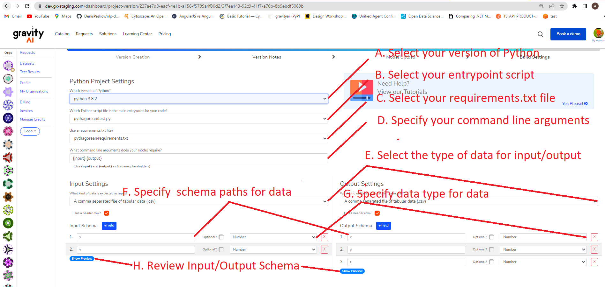
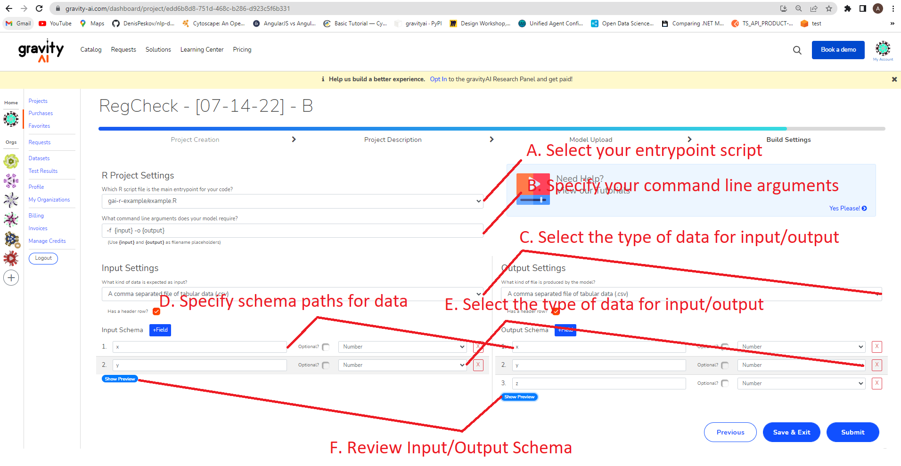

# Building Python Projects



**A.** Select your version of Python <br/>
- Currently gravityAI supports 3.5-3.10 for CPU only and 3.8-3.10 for GPU. <br/>
**B.** Select your entrypoint script <br/>
**C.** Select your requirements.txt file <br/>
**D.** Specify your command line arguments <br/>
- Say if your script is to run like 
python entrypoint.py test_file.csv result.csv
then you would simply input: 
```{input} {output}``` <br/>
- See input and output for more details. <br/> 
**E.** Select the type of data for input/output <br/>
**F.** Specify schema paths for data <br/>
- See schema path for more details. <br/>
**G.** Specify data type for data <br/>
**H.** Review Input/Output Schema <br/>


# Building R Projects


**A.** Select your entrypoint script <br/>
**B.** Specify your command line arguments <br/>
**C.** Select the type of data for input/output <br/>
**D.** Specify schema paths for data <br/>
- See schema path for more details. <br/>
**E.** Select the type of data for input/output <br/>
**F.** Review Input/Output Schema <br/>


# Dependency Management

While we have plans for expanding dependency management support, currently we only manage dependencies through **requirements.txt** files (Python) or **renv** (R).  

There is no need to install/package your dependencies prior to the upload; we will install them in the container during our build process.

# Directory Structure

There are numerous ways of structuring your projects, and we try our best not to dictate to you how to do so. As such, you can have as many nested directories as you like (but being reasonable is always a nice thing ;-)).  We should be able to detect both your entry script and the file used for managing dependencies; whether this be a **requirements.txt** file (in the case of coding a Python project) or **renv/** (in the case of R projects).