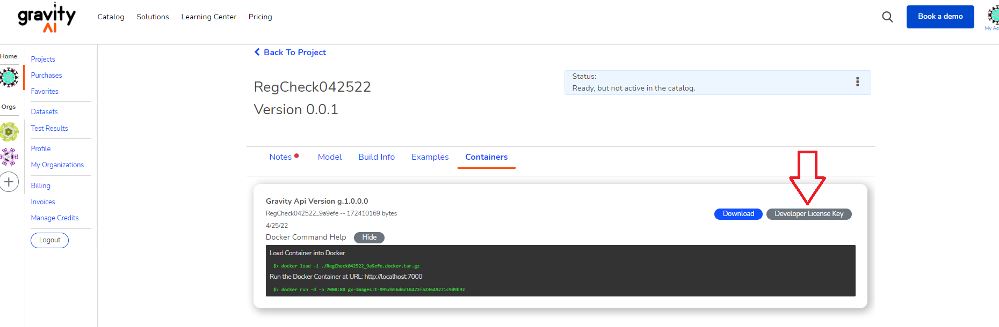

# License Keys

<i>Note: The following does not apply to enterprise version of the marketplace.</i>

License keys are required to access gravity ai containers. Keys expire on a regular interval of {{expiration.license.duration_in_days}} days and must be updated.

## Developer License Keys

During development, you might need a "developer license key" in order to test your model. You can easily download once your project has finished building.

## Sharing license keys for the same image

 Say if you were running several containers, running the same image.  You can share data (including license keys) amongst those containers (again, assuming they're the exact same image).  

 See here for more information
 - [Sharing Data](/sharing-data)