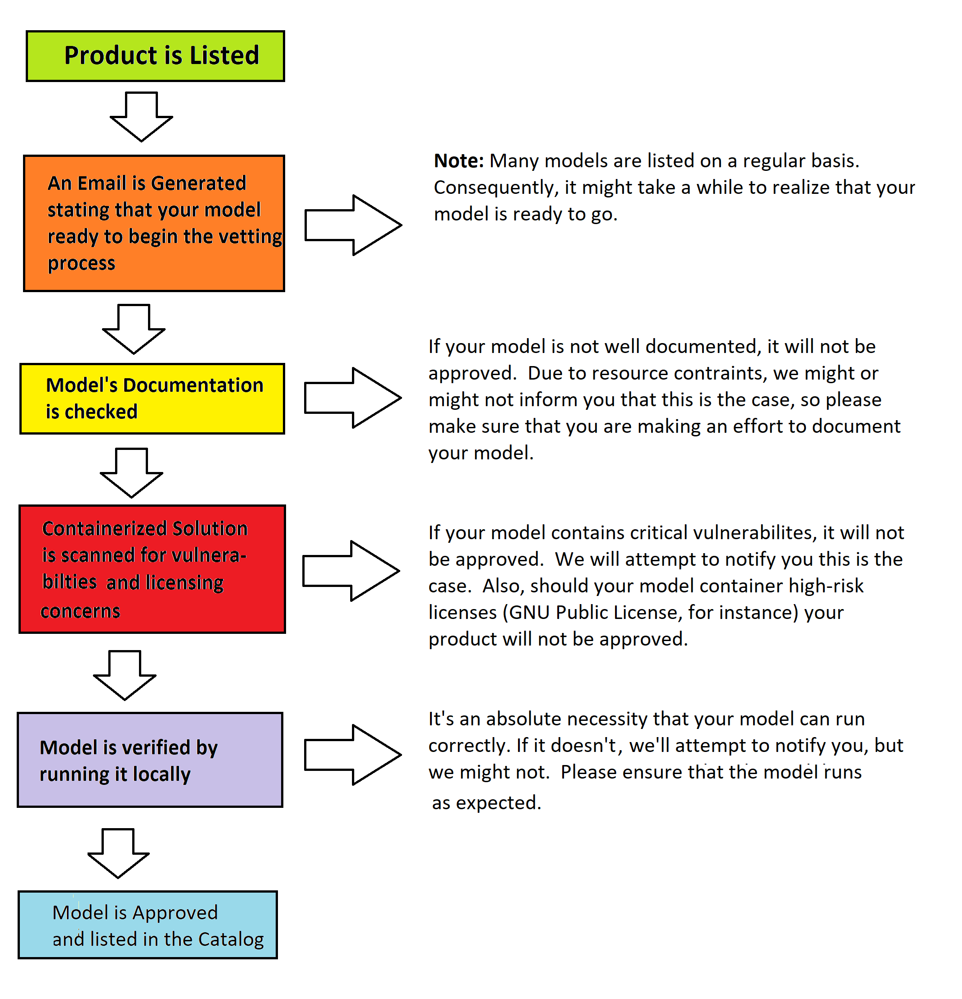

# Model Approval Process

While building models for gravityAI, one must always remember that buyers are trusting you (and, in extension, us) to provide a solution that is reliable, performant, well documented, and secure.  In order to achieve some sense of this, models must go through a process to get approved and listed in our catalog:

Namely: 

1. Models must be well documented.
   Note: If you want an example of a well documented model, check out the documentation from <a href="https://www.gravity-ai.com/catalog/product/finsent-sentiment" target="_blank">this one</a>.
    
    * What’s the input and output?
    * What are the use cases of your model?
    * What are the ethical concerns of your model (if any)?
    * What are the limitations of your model?   

2. Models must be performant and reliable.
    
    * How much memory should be allocated to Docker in order to run your model?
    * What specs are required to run the model?
    * What is the expected runtime for your model per job?  How does this runtime scale with varying input sizes?
    * How accurate is your model?
    * How precise is your model?

3. Models must be as secure as possible.
    
    * Vulnerabilities will be scanned for and should there be vulnerabilities of a critical level, they will not be accepted.  So try to make sure that the model is using up-to-date libraries, if at all possible.

In particular, from the point you list your model, the approval process might flow as follows… 

## Model Approval FAQ

**Q: Why hasn’t my model been approved yet? It’s been ___ weeks.**  
**A:** While we endeavor to get to as many models as possible, we are a small team with a lot of people wearing different hats. Sadly, it might take a while before we can get to your particular model.  But get to your model we shall!