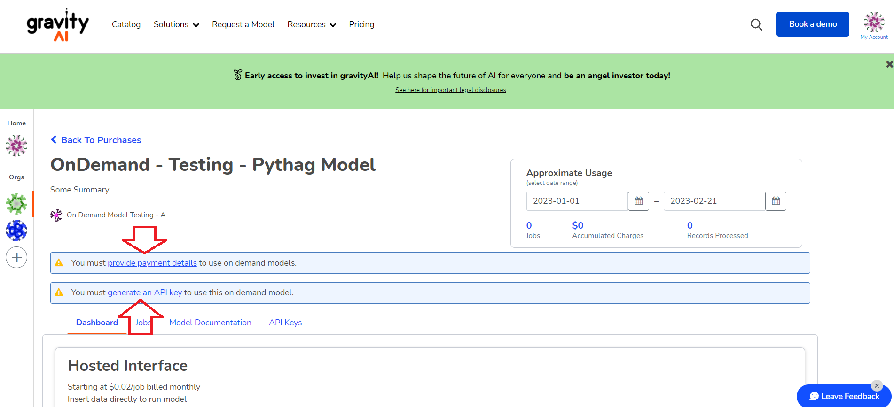

# Overview

# Purchasing an On-Demand Model
## Step 1: Locate the model in the catalog you wish to purchase

## Step 2: Select the organization you want to run the on-demand model

## Step 3: Go to the purchased model dashboard

## Step 4: Notice that you have to supply billing details and generate an API key

## Step 5: Fill out your payment details

## Step 6: Congrats you've purchased an on-demand model!

# Generate an API Key
## Step 1: Now you need to generate an API Key

## Step 2: Note that this API key must be kept secret

## Step 3: Don't forget to save the API key for later

# Using Swagger to Submit On-Demand Jobs
In order to submit jobs via swagger, you will have to go to:
 
<a href="https://on-demand.gravity-ai.com/swagger/index.html">https://on-demand.gravity-ai.com/swagger/index.html</a>

See [<u>"On-Demand Jobs API"</u>](jobs-api.md) for more details.

## Step 1: Authorize the API Key in swagger

## Step 2: Submit a job in Swagger

## Step 3: Don't forget to save the job id 

## Step 4: You can then supply the jobId and geta download link 

## Step 5: You can then supply the jobId and geta download link 

