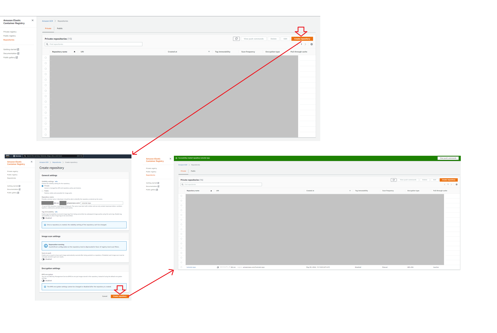
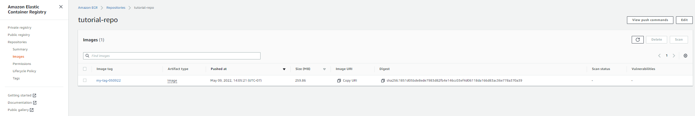
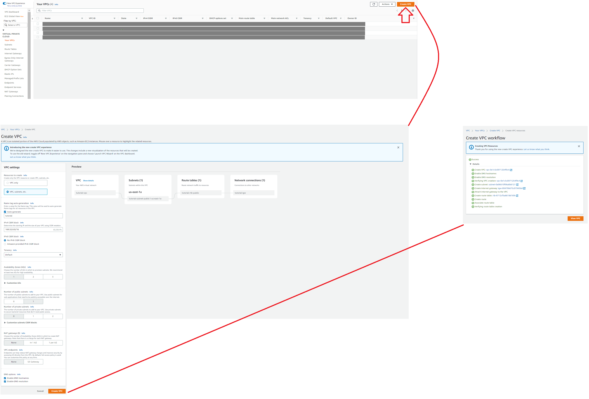
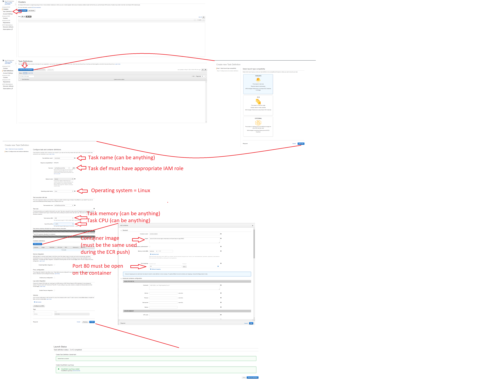
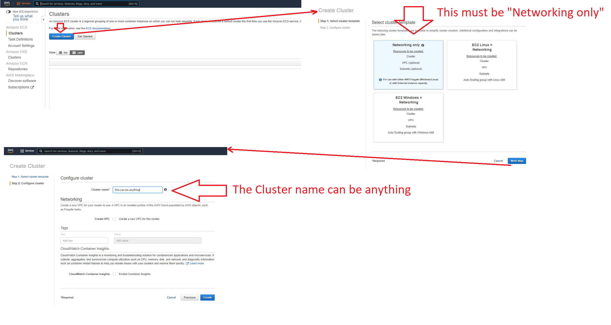
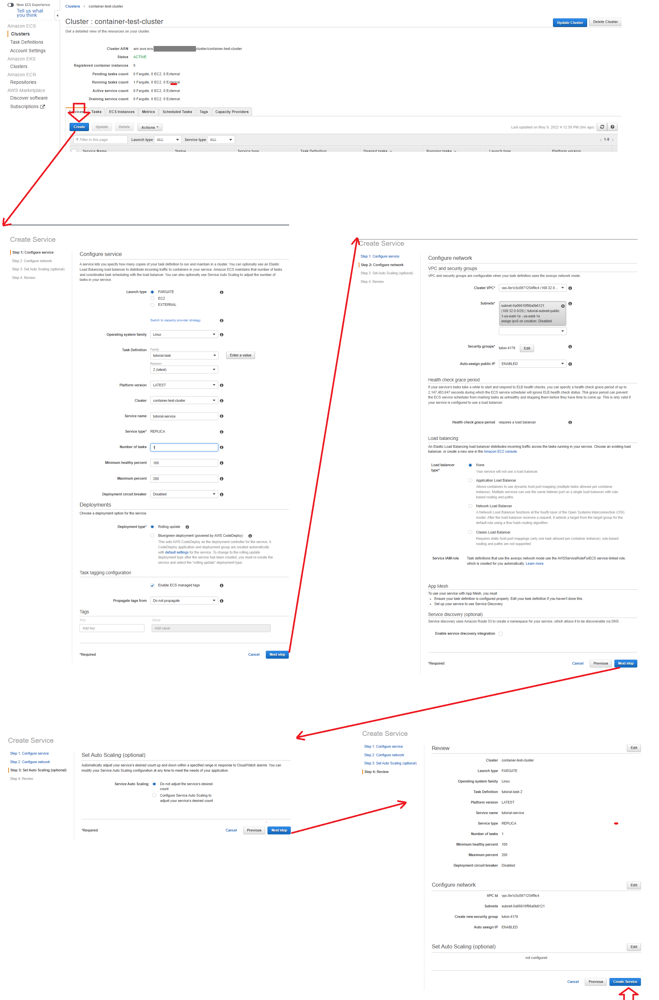
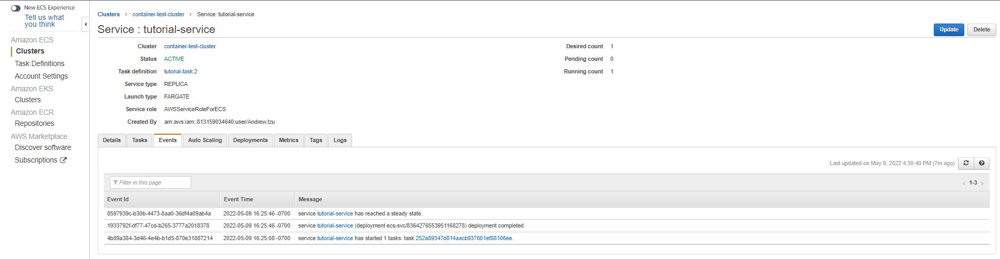
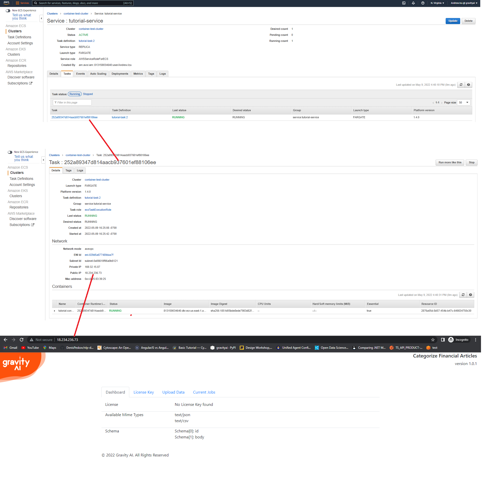

# Integrating Production Containers

Production ready models all have a standard API interface. They are supplied as part of a Docker Container.

## Running the container locally

Models are downloaded as container images that need to be imported into your docker repository. After the download completes, you can import it into your local docker repository with the following command (replace 'model_name_123abc.tar.gz' with the actual file name):

```
docker load -i .\model_name_123abc.tar.gz
```

If the import is successful you should see a message similar to this:

```
Loaded image: gx-images:t-12345678abcd1234abcd12345678abcd
```

Use that image tag name to start and run your container:

```
docker run -d -p 9090:80 gx-images:t-12345678abcd1234abcd12345678abcd
```

You should now be able to access the container at `http://localhost:9090`.

<i>Note: This example uses port 9090. Change this value to your desired port number for deployment.</i>

## Running the container on AWS

Once one has loaded your docker volume, one can host it on AWS in an ECS cluster.
<br/><br/>
In order to accomplish this one might consider doing the following...
<br/>
<ul>
<li>Setting up AWS CLI</li>
<li>Log into AWS ECR</li>
<li>Pushing the model image to Amazon ECR</li>
<li>Setup a VPC</li>
<li>Creating an ECS Task Definition</li>
<li>Creating an ECS Cluster and Service</li>
</ul>

### Setting up AWS CLI

The best thing to do for this might be to follow AWS's documentation.  Note that you will need to configure AWS CLI once it's installed.

Documentation can be found here: [Getting started with the AWS CLI](https://docs.aws.amazon.com/cli/latest/userguide/cli-chap-getting-started).

### Log into AWS ECR

Before pushing your image AWS ECR, you must first log in, which you can do by doing something like this

`aws ecr get-login-password --region aws-region | docker login --username AWS --password-stdin aws-account-id.dkr.ecr.aws-region.amazonaws.com`

Where <b>aws-region</b> and <b>aws-account-id</b> are your associated region (e.g. us-east-1, us-east-2, us-west-1, etc.) and aws account id.  

### Pushing the model image to Amazon ECR
Prior to pushing an image to ECR, one must create their ECR repo for hosting their image on AWS.  This is easily done using AWS Console...




Assuming you have downloaded & loaded your model's image from gravity-ai, you might see the image presented like this...

```powershell
PS C:\Users\Me> docker image ls
REPOSITORY                                            TAG                                                   IMAGE ID       CREATED         SIZE
gx-images                                             t-325c9650457f47999406dd1c61b913c3                    b9f4fb53abc7   3 days ago      809MB
```

In order to retag this image to a form for the push, you can easily change the repository and associated tag by using `docker image tag`.
Note that the repository associated with the image must match the ECR repo just created. The image repo and tag must also be of the following form...
<br/>
`aws-account-id.dkr.ecr.aws-region.amazonaws.com/tutorial-repo:my-tag-050922`


```powershell                                                                 
PS C:\Users\Me> docker image tag gx-images:t-325c9650457f47999406dd1c61b913c3 123456789012.dkr.ecr.us-west-1.amazonaws.com/tutorial-repo:my-tag-050922
PS C:\Users\Me> docker image ls
REPOSITORY                                                                 TAG                                                   IMAGE ID       CREATED         SIZE
gx-images                                                                  t-325c9650457f47999406dd1c61b913c3                    b9f4fb53abc7   3 days ago      809MB
123456789012.dkr.ecr.us-west-1.amazonaws.com/tutorial-repo:my-tag-050922   my-tag-050922                                         b9f4fb53abc7   3 days ago      809MB
```

You should now be able to see your model's image in the ECR repo.



### Setup a VPC
There are numerous ways of creating a VPC for hosting your image.  In this particular case, we're keeping it as simple as possible, however feel free to modify your VPC in a manner you see fit.
<ul>
<li>Simply look for "VPC" using the AWS search bar</li>
<li>Click on "Virtual Private Cloud" -> "Your VPCs" in the side navigation menu</li>
<li>L-Click: Create VPC</li>
<li>Configure your VPC</li>
</ul>

#### Configure your VPC
You can configure your VPC in a manner you see fit.  Below, we are using one subnet and availability zone.  




### Creating an ECS Task Definition
<ul>
<li>Look for "ECS" using the AWS search bar & L-Click: "Elastic Container Service"</li>
<li>L-click: "Task Definitions" in the left side menu</li>
<li>Create the taskdef</li>
</ul>

#### Create the taskdef
Note: The only changes required are:
<ul>
<li>The task definition name</li>
<li>The task IAM role</li>
<li>The operating system (must be Linux)</li>
<li>Task Memory (this is specific to your model's needs)</li>
<li>Task CPU (this is specific to your model's needs)</li>
<li>The container image; this should be of the same form used during the push (e.g. aws-account-id.dkr.ecr.aws-region.amazonaws.com/tutorial-repo:my-tag-050922)</li>
<li>The container should have a container TCP port 80 open</li>
</ul> 


### Creating an ECS Cluster and Service
#### Creating an ECS Cluster
<ul>
<li>Look for "ECS" using the AWS search bar & L-Click: "Elastic Container Service"</li>
<li>L-Click: Create Cluster</li>
<li>Select: Networking only</li>
<li>Input: Cluster Name (this can be anything)</li>
</ul>


#### Creating an ECS Service
Note: In this case, we are hosting on a public VPC and subnet, as well as auto-assigning a public IP address.  You can change this and setup your own network infrastructure in a way you deem appropriate. 

<ul>
<li>L-Click: On the cluster you just created</li>
<li>[On the Service Tab] L-Click: Create</li>
<li>[Step 1: Configure service] Launch Type: Fargate</li>
<li>[Step 1: Configure service] Operating System Family: Linux</li>
<li>[Step 1: Configure service] Task Defition and Revision: Select relevant task definition you wish to launch (the one you just created)</li>
<li>[Step 1: Configure service] Service Name: This can be anything</li>
<li>[Step 1: Configure service] Number of Tasks: 1</li>
<li>[Step 1: Configure service] Deployment type: Rolling update</li>
<li>[Step 2: Configure network] Cluster VPC: Select the VPC you want to host from</li>
<li>[Step 2: Configure network] Subnets: Select the subnet you want to host from</li>
<li>Leave the rest as default and create service</li>
</ul>


You can confirm that the deployment of the task def has resolved by going to your service's event's tab.  If your service has reached a "steady state" you are probably O.K.



You may then access the service, in webpage form, by going to the task definition's public ip address.




## Using Volumes to Persist Data

If you want to persist data for a container (or share the job queue amongst multiple containers) you need to create a docker volume. (Example shows creating a volume with name 'data-vol')

```
docker volume create data-vol
```

When you run the container, you need to bind this volume to the container using the --mount option:

```
docker run -d -p 9090:80 --mount source=data-vol,target=/var/gai_data gx-images:t-12345678abcd1234abcd12345678abcd
```

<b>Important:</b> If you are using different models from gravity ai, each type of model should use a different volume. Sharing a volume between different model containers is not supported and may cause errors and data corruption.

# Submitting Data

<i>Note: Before data can be submitted, you may need to apply a [license key](/license-keys) to the container</i>

Production Models container a Swagger Endpoint to describe the api. this can be accessed at `http://localhost:9090/swagger`.

Data can be uploaded manually using the container GUI at `http://localhost:9090/AddJob`, or POST to the api endpoint '`http://localhost:9090/data/add-job`.

## Mapping Data

An optional [mapping file](mapping-file.md) may be supplied when submitting structured data. This is typically used to transform data that doesn't follow the exact schema used by the model. It allows the fields from the source data to map to the fields used by the model. If you have previously tested data against this model in the marketplace, a mapping file can be downloaded from your test results page. It can also be created manually.
